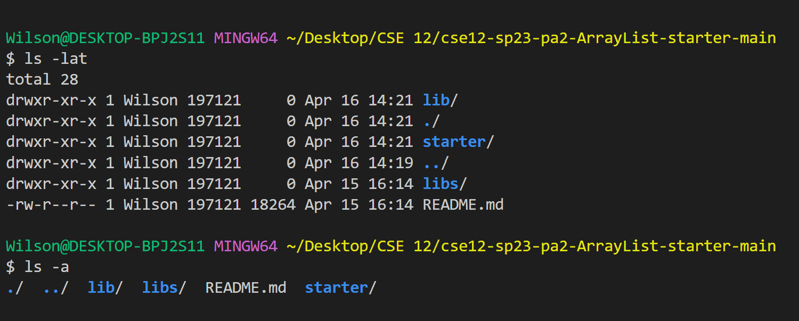
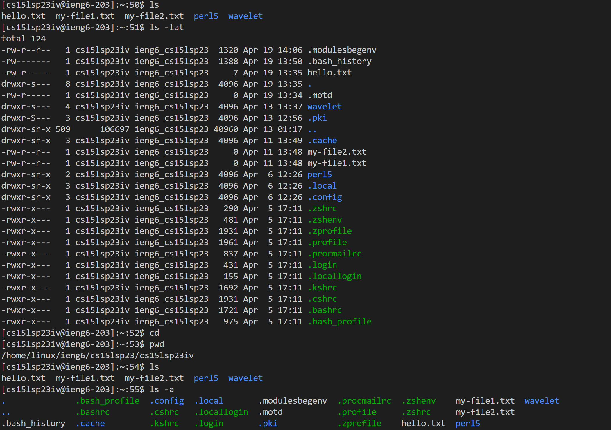
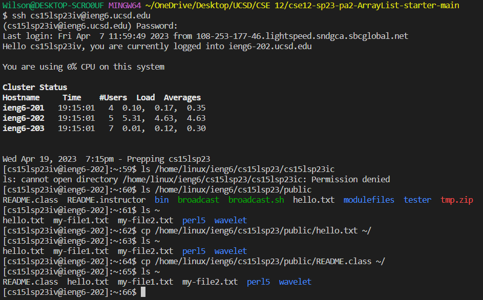

# Lab Report 1
## How to setup and login your cse15l account
1. Go into the following [website](https://sdacs.ucsd.edu/~icc/index.php).
2. [Here](https://drive.google.com/file/d/17IDZn8Qq7Q0RkYMxdiIR0o6HJ3B5YqSW/view) on a video guide as to how to reset your password.

**Important notes:**
- Make sure that once you sign in to the website that you click on the grey square containing your username starting with cs15l.
- Make sure that when you are prompted for a username you copy and paste the one you found in the grey box starting with cs15l.

## How to setup a connection with a remote server
1. Download VSCode [Here](https://code.visualstudio.com/). There should not be any difficulties with installing VSCode as long as you continue to choose the default options selected by the installer. It looks like this when you are done:

2. If you are on Windows download [Git for Windows](https://gitforwindows.org/), but if you are on MAC you can skip this step. Just use the default options when prompted.
3. Once Git is installed or if you are on MAC, follow the instructions [here](https://stackoverflow.com/questions/42606837/how-do-i-use-bash-on-windows-from-the-visual-studio-code-integrated-terminal/50527994#50527994).
4. Once you have selected bash in the terminal you should paste the following `ssh cs15lsp23zz@ieng6.ucsd.edu`, except you should replace the "cs15lsp23zz" with what your username is.
5. Then it will ask `Are you sure you want to continue connecting (yes/no/[fingerprint])?`. Type **YES**. Then it will ask for your password. **NOTE: YOU WILL NOT BE ABLE TO SEE WHAT YOU ARE TYPING, BUT YOU ARE ACTUALLY TYPING SO JUST CLICK ENTER WHEN YOU ARE DONE TYPING**
6. Once you press enter you should see something similar to this: 

## Running some commands
You can try out some commands like `cd`, `ls`, `pwd`, `mkdir`, and `cp` in the terminal. If you want to exit the remote terminal just type exit in the terminal. Below you can see how this should look like for some commands. 

Describing commands:
- `cat` on ieng6 - I used `cat /home/linux/ieng6/cs15lsp23/public/hello.txt` on the remote server, which is supposed to be print the contents of `hello.txt` according to the path I provided, but as you can see there is no such path. 
- `pwd` - Then to run commands on my local computer I typed exit and entered, then ran the pwd to see my local working directory. 
- `ls` - In the second and third picture below, I executed the `ls` command with certain modifiers like `ls - lat` and `ls -a` and also the normal `ls`. `ls` on its own will list the files in a certain manner. With `-lat` it will display each file in the current working directory in a row each with details like the user and data accessed. With `-a` it is similar with normal `ls` but contains more from `..` referring to the parent directory and the current working directory. On the fourth image below we can see how I tried to list the files in a classmates folder and it denied access. 
- `cp /home/linux/ieng6/cs15lsp23/public/README.class ~/ ` - This command uses `cp` to copy `README.class` from the path `/home/linux/ieng6/cs15lsp23/public/README.class` to the home directory represented by `~/`. In the fourth image below, I show how initially there is no `README.class` in the home directory then after `cp` it is copied there. 
- `cd` - changes the working directory.
- `pwd` - displays the current working directory.
- `mkdir` - makes a new directory.
 

